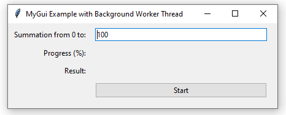
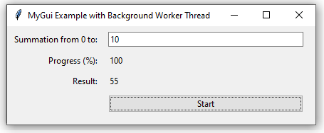

# GUI-with-backend-worker

The aim of this project is building GUI to sum from 0 to the given number. Calculating at the backend and show the result **synchronously** at the frontend. 

## Introduction

- **Tools**: python
  
- **Package**: tkinter, threading

- **Main purpose**: Calculating data at the backend and showing the result at the frontend at the same time. 

- **Solution**: Combine GUI and threading together. Building a new working thread to calculate the data, which is not affected to the thread running GUI. 

## Screenshots

### Initial interface 

 

### Final interface 

## Difficulties

- **Pass variables** from the backend to the frontend.
  
- Build **a new thread at the backend**.

- How to **prevent the threads locked.**

## Further improvement 

- Add the **progress bar.**

## How to use 

Download all the codes in **src folder**. Then run the **main.py** directly. 